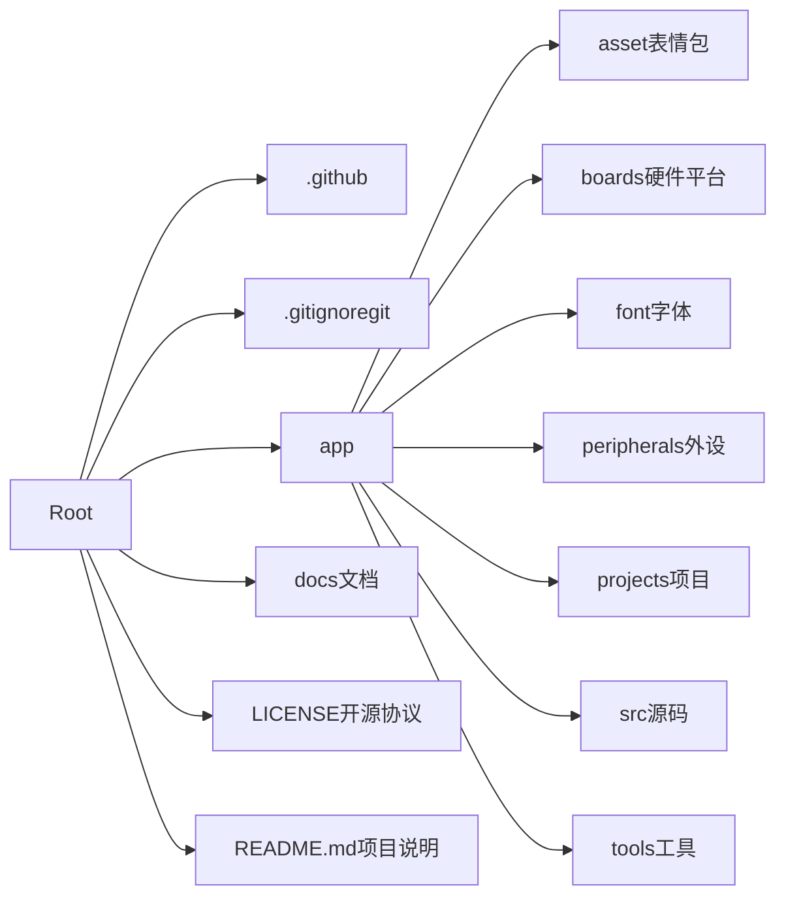

# 小智聊天机器人

本示例通过互联网连上小智机器人的服务器，实现了一个有语音和显示的聊天机器人，互联网底层基于蓝牙 PAN 协议

项目 fork 自[虾哥小智](https://github.com/78/xiaozhi-sf32)

自搓的 PCB 项目详见地址：[RS 版小智机器人](https://oshwhub.com/rovesoul/rs-ai-desktop-robot)

## 快速入门

请参考官方文档的[快速入门指南](https://docs.sifli.com/projects/xiaozhi/get-started/)进行设备连接、激活和基础使用。

## 源码构建

如需自行编译和烧写固件，请参考[源码构建文档](https://docs.sifli.com/projects/xiaozhi/source-build/)。

## 支持硬件

- [SF32LB52-DevKit-LCD](https://wiki.sifli.com/board/sf32lb52x/SF32LB52-DevKit-LCD.html)
- [立创黄山派](https://wiki.sifli.com/board/sf32lb52x/SF32LB52-%E9%BB%84%E5%B1%B1%E6%B4%BE.html)
- [SF32LB52-Nano-52j](https://wiki.sifli.com/board/sf32lb52x/SF32LB52-DevKit-Nano.html)

## 支持特性

- 蓝牙 PAN 联网
- 采用 OPUS 音频编解码
- 基于流式 ASR + LLM + TTS 架构的语音交互
- 电量显示与电源管理
- 通过设备端 MCP 实现设备控制（音量、灯光、电机、GPIO 等）
- 通过云端 MCP 扩展大模型能力（智能家居控制、PC 桌面操作、知识搜索、邮件收发等）
- 支持关键词唤醒（小智小智）,可通过下拉菜单动态控制是否启用该功能
- 主界面显示与页面切换
- 支持 AEC 以支持实时对话

## 管理地址

后台管理地址为: <https://xiaozhi.me>

项目文件结构：

